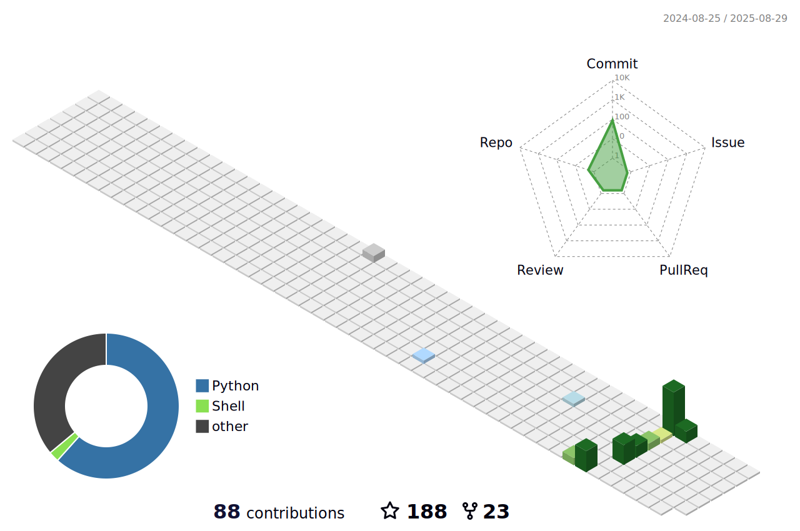
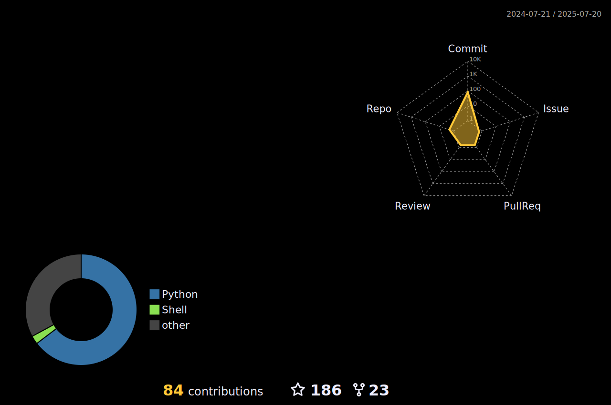

<!-- Header with dark background -->
<!--div style="background-color: #0d1117; padding: 20px; color: white; border-radius: 10px;"-->
  
  

<!-- Introduction -->
<h1> Hello, I'm a blockchain developer </h1>

  

<!--   About me -->
## Blockchain Developer & DeFi Architect

<!--<-->

I’m a Blockchain & AI Developer with hands-on expertise in building scalable decentralized applications (DApps), DeFi platforms, and smart contracts. 
I specialize in creating end-to-end solutions that merge cutting-edge AI capabilities with blockchain technology, empowering next-generation Web3 ecosystems.

 
💡 AI & Blockchain Developer with strong experience in: 

- Front-end Development: ReactJS, NextJS → building pixel-perfect, responsive UIs for Web3 applications.
- Back-end Engineering: NestJS & Golang → creating robust, high-performance APIs and microservices.
- Smart Contracts: Solidity & Rust → designing secure and optimized contracts for Ethereum, EVM chains, and Solana.
- Blockchain Solutions: Tokenization, DeFi protocols, NFT marketplaces, DAO governance, and cross-chain integrations.
- AI Integration: Leveraging machine learning & AI models to enhance blockchain use cases like predictive analytics, automation, and intelligent dApps.

⚡ I thrive on solving complex problems, bridging AI + blockchain innovation, and delivering impactful decentralized solutions that scale.

<!-- Programming languages & Technologies -->

## 💻 Tech Stack AND TOOLS

<table align="center">
  <tr>
    <td align="center" width="90">
      
       React
    </td>
    <td align="center" width="90">
      
       Next.js
    </td>
    <td align="center" width="90">
      
       Vue
    </td>
    <td align="center" width="90">
      
       Nuxt.js
    </td>
    <td align="center" width="90">
      
       Angular
    </td>
    <td align="center" width="90">
      
       Express
    </td>
    <td align="center" width="90">
      
       Laravel
    </td>
    <td align="center" width="90">
      
       Rails
    </td>
    <td align="center" width="90">
      
       Django
    </td>
    <td align="center" width="90">
      
       Phoenix
    </td>
  </tr>
  <tr>
    <td align="center" width="90">
      
       Javascript
    </td>
    <td align="center" width="90">
      
       Typescript
    </td>
    <td align="center" width="90">
      
       PHP
    </td>
    <td align="center" width="90">
      
       Ruby
    </td>
    <td align="center" width="90">
      
       Python
    </td>
    <td align="center" width="90">
      
       MongoDB
    </td>
    <td align="center" width="90">
      
       MySQL
    </td>
    <td align="center" width="90">
      
       PostgreSQL
    </td>
    <td align="center" width="90">
      
       SQLite
    </td>
    <td align="center" width="90">
      
       Supabase
    </td>
  </tr>
  <tr>
    <td align="center" width="90">
      
       Flutter
    </td>
    <td align="center" width="90">
      
       Android
    </td>
    <td align="center" width="90">
      
       MaterialUI
    </td>
    <td align="center" width="90">
      
       Tailwind
    </td>
    <td align="center" width="90">
      
       Styled
    </td>
    <td align="center" width="90">
      
       Three.js
    </td>
    <td align="center" width="90">
      
       NFT
    </td>
    <td align="center" width="90">
      
       DeFi
    </td>
    <td align="center" width="90">
      
       Solidity
    </td>
    <td align="center" width="90">
      
       Rust
    </td>
  </tr>
</table>

## 🔗 Blockchain Ecosystems

- **Ethereum** - Smart contracts, ERC standards, DeFi protocols
- **Solana** - High-performance dApps, SPL tokens
- **Polkadot** - Parachains, Cross-chain communication
- **Layer 2** - Optimistic Rollups, zkRollups, State Channels
- **IPFS & Filecoin** - Decentralized storage solutions
- **Web3 Infrastructure** - TheGraph, Chainlink, Infura

## 📝 Blockchain Articles & Research 

  
  <ul>
    <li><a href="https://dev.to/">Implementing Zero-Knowledge Proofs in Modern DeFi Applications</a></li>
    <li><a href="https://dev.to/">Cross-Chain Interoperability: Challenges and Solutions</a></li>
    <li><a href="https://dev.to/">Gas Optimization Techniques for Ethereum Smart Contracts</a></li>
    <li><a href="https://medium.com/">Security Best Practices for Smart Contract Development</a></li>
    <li><a href="https://dev.to/">The Evolution of Consensus Mechanisms: From PoW to PoS and Beyond</a></li>
  </ul>

## 🏆 Certifications & Achievements

- **Certified Ethereum Developer** - Ethereum Foundation
- **Polkadot Blockchain Academy** - Web3 Foundation
- **Chainlink Certified Developer** - Chainlink Labs
- **1st Place** - ETHGlobal Hackathon 2022
- **Security Auditor** - Immunefi Bug Bounty Program
  

  
<!--
 
 
-->
 

## 📈 Github State

 <!-- Dynamic contribution graph - shows your activity in real-time -->
   <a href="https://github.com/constellation-infinity#gh-light-mode-only">

 

## 🚀 Featured Projects

<!-- Dynamic repository cards - update automatically with latest stats -->

<a href="https://github.com/constellation-infinity/creon-tech-showcase">
<picture>
  <source
    srcset="https://github-readme-stats.vercel.app/api/pin/?username=constellation-infinity&repo=creon-tech-showcase&theme=ambient_gradient&cache_seconds=1800&show_owner=true"
    media="(prefers-color-scheme: dark)"
  />
  
</picture>
</a>

<a href="https://github.com/constellation-infinity/abdk-libraries-solidity">
<picture>
  <source
    srcset="https://github-readme-stats.vercel.app/api/pin/?username=constellation-infinity&repo=abdk-libraries-solidity&theme=ambient_gradient&cache_seconds=1800&show_owner=true"
    media="(prefers-color-scheme: dark)"
  />
  
</picture>
</a>

